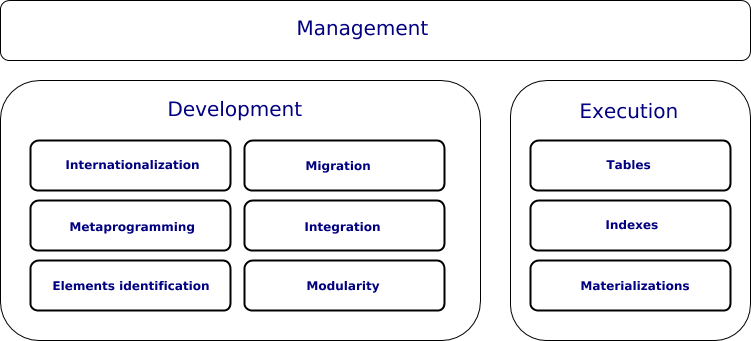

The physical model consists of three parts: 

[Development](Development.md)

Includes everything related to the development process.

[Execution](Execution.md)

Includes everything related to the system performance improvement.

[Management](Management.md)

Includes everything related to operations on an already working system.

### Stack

