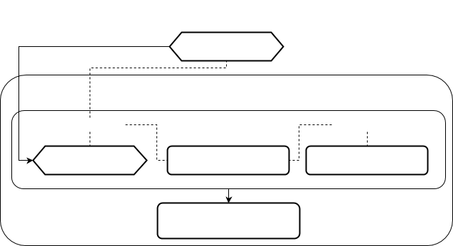

Ключевым элементом логики представлений является [форма](Forms.md). Именно при помощи форм в платформе организуется ввод и вывод информации в систему (из системы).

### Навигатор

В самом простом варианте пользовательского интерфейса пользователю открываются несколько фиксированных форм, с которыми он будет работать, переключаясь между вкладками. Однако если форм, с которыми работает пользователь, много, открывать их все сразу не очень удобно. В таких случаях для управления работой с формами можно использовать так называемый [навигатор](Navigator.md). В этом случае, при старте клиента пользователю показывается только сам навигатор (никакие формы не открываются), и пользователь может открывать формы самостоятельно по мере их необходимости. Более того, в навигаторе пользователь может не только открывать формы [в интерактивном представлении](In_an_interactive_view_SHOW_DIALOG_.md), но и вообще выполнять любые [действия](Actions.md).

### Стек

