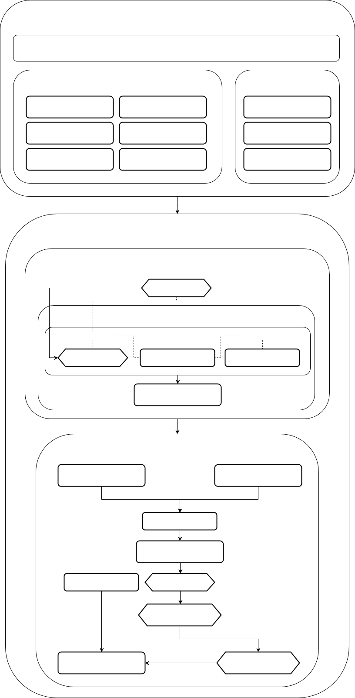

Парадигму можно условно разделить на две части:

[Логическая модель](Logical_model.md)

Описывает непосредственно функционал системы, то есть то, что система умеет делать, какие данные принимает на вход, и какие отдает на выход.

Физическая модель

Включает в себя все остальное - все что связано с процессами разработки, улучшения производительности и управления работающей системой.

### Стек

**  
**

