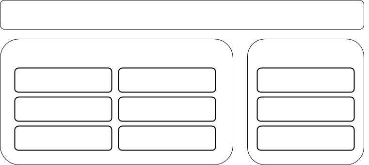

Физическая модель состоит из трех частей: 

[Разработка](Development.md)

Включает в себя все то, что связано с процессом разработки.

[Выполнение](Execution.md)

Включает в себя все то, что связано с повышением производительности системы.

[Управление](Management.md)

Включает в себя все то, что связано с операциями над уже работающей системой.

### Стек

  
